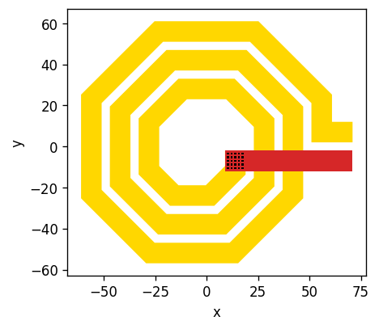
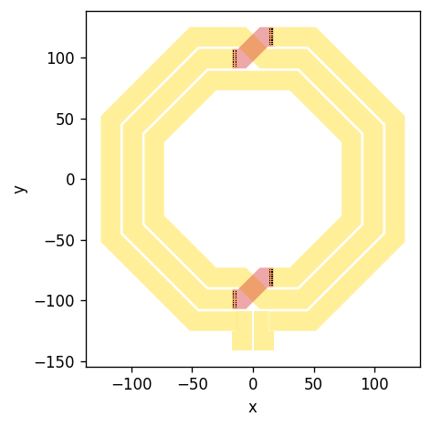
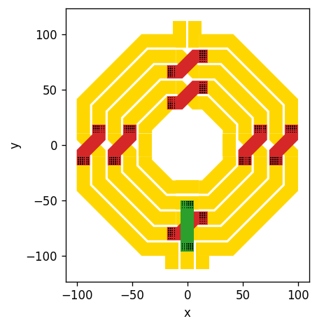

# RapidPassives - DRC-clean RFIC Inductor and Transformer Layout Generation

RapidPassives is a tool for generating GDS files for RFIC inductors and transformers with arbitrary numbers of windings and winding ratios. In addition to the grometry generators, checker methods are implemented that ensure a valid geometry without clipping or overlap.

## Spiral Inductors


```python
from rapidpassives import SpiralInductor

#instantiate the inductor for some geometry parameters
Ind = SpiralInductor(
    Dout=150, 
    N=3, 
    sides=8, 
    width=12, 
    spacing=2, 
    via_spacing=0.8, 
    via_width=1, 
    via_in_metal=0.45)

#plot the geometry
Ind.plot()

#export as gds file
Ind.to_gds("examples/spiralinductor.gds")
```


    

    


## Symmetric Inductors


```python
from rapidpassives import SymmetricInductor

#instantiate the inductor for some geometry parameters
Ind = SymmetricInductor(
    Dout=250, 
    N=3, 
    sides=8, 
    width=16, 
    spacing=2, 
    center_tap=False, 
    via_spacing=0.8, 
    via_width=1, 
    via_in_metal=0.45)

#plot the geometry
Ind.plot()

#export as gds file
Ind.to_gds("examples/symmetricinductor.gds")
```


    

    


## Symmetric interleaved Transformers


```python
from rapidpassives import SymmetricTransformer

#instantiate the transformer for some geometry parameters
Trf = SymmetricTransformer(
    Dout=200, 
    N1=2, 
    N2=3, 
    sides=8, 
    width=12, 
    spacing=2, 
    center_tap_primary=True, 
    center_tap_secondary=False, 
    via_spacing=0.8, 
    via_width=1, 
    via_in_metal=0.45, 
    via_merge=False)

#plot the geometry
Trf.plot()

#export as gds file
Trf.to_gds("examples/symmetrictransformer.gds")
```


    

    


```python

```
